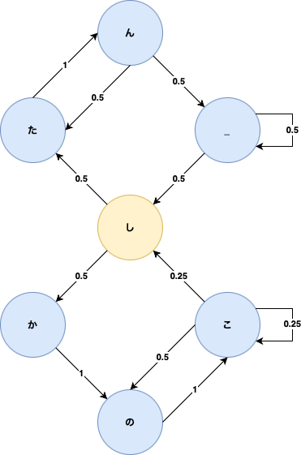

# Shikov

## Introduction
Use Markov chain to generate Shikairo Day

I cut the original video by each syllable and an additional rest beat (marked as "_").

The program will randomly travel through the Markov chain based on the transition matrix and generate the video (which is usually kinda like a otoMAD lmao).

The standard sentence is "しかのこのこのここしたんたん__". In my code I will force the program retry until it produces a list containing a segment of this standard lyric (although it is probably not easy to identify because it is assembled by syllables I cut instead of a natural & consistent lyric from the original video).
You can edit the code and get rid of my limit and try your own to see what it will generate :).

I have put the standard sample "standard.mov" here as a reference. 

The Markov chain plot is as following:

## Requirements

The program is interpreted by python3

The following packages are needed

1. moviepy

    `pip install miviepy`

2. ffmpeg

    `brew install ffmpeg`

## Run
To run the program, do the following:
   `python shikov.py`

## Credit

This project is inspired by the YouTube video https://www.youtube.com/watch?v=Xkq13ZthmA0.

I have contacted the video author and get the permission of referencing this video for the project. 
Thanks to Kat for the interesting and inspiring video and the fantastic idea.